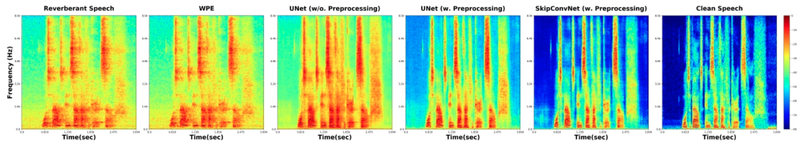
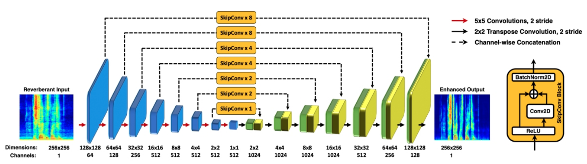
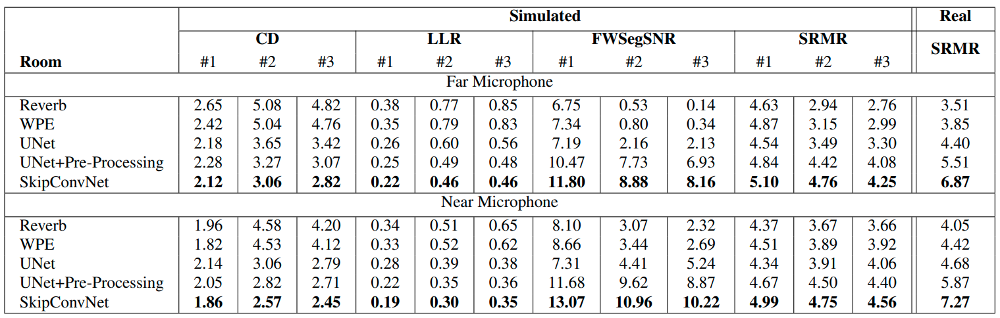

# <b>SkipConvNet</b> [[Interspeech 2020]](https://arxiv.org/abs/2007.09131)



**SkipConvNet: Skip Convolutional Neural Network for Speech
Dereverberation using Optimally Smoothed Spectral Mapping** <br>
Vinay Kothapally, Wei Xia, Shahram Ghorbani, John H.L Hansen, Wei Xue, Jing Huang<br>

**This repository contains official implementation of SkipConvNet for Reverb Challenge Corpus** <br>

## Getting started

### Required Installations
- Get [CUDA 10.1](https://developer.nvidia.com/cuda-10.1-download-archive-base)
  installed on your machine.
- Install PyTorch ([pytorch.org](http://pytorch.org)).
- Install [Apex](https://github.com/NVIDIA/apex/) from its official repo. This
  will require CUDA 10.1 to work with the latest pytorch version (which is
`pytorch=1.3.1` as being tested against). It is used for fast mix-precision
inference and should work out of the box.
- Install [PyTorch-Lightning](https://github.com/PyTorchLightning/pytorch-lightning) from its official repo.
- Install pkbar, soundfile, kaldiio, librosa 


### SkipConNet Network



The feature information transfered from encoder to the decoder in a FCN using skip connection have a semantic gap. Addition of a few convolutional layers
within each skip connection can compensate for the semantic gap by transforming the learnt features at encoder to be more
intuitive to the decoder. Thus, the learning ability of FCN’s can potentially be maximized.

### Quick Run - For Enhancing your audiofiles

Create a scp file with reverberant absolute locations of reverberant and enhanced audiofiles as follows

``` bash
myaudiofiles.scp

reverb_01 /home/...../reverb/reverb_01.wav /home/...../enhance/reverb_01_enhanced.wav
reverb_02 /home/...../reverb/reverb_02.wav /home/...../enhance/reverb_02_enhanced.wav
reverb_03 /home/...../reverb/reverb_03.wav /home/...../enhance/reverb_03_enhanced.wav
...
...

```

Run the demo file - (Make sure you go through scripts and comment mentioned lines to run on your system)

```bash
python demo.py --audiofilelist myaudiofiles.scp
```

### Reverb Challenge (2014) - Train & Evaluate

This repo uses datapreperation files from Kaldi recipie. Please make sure you run the datapreperation for Reverb Challenge using [Kaldi](https://github.com/kaldi-asr/kaldi/tree/master/egs/reverb/) scripts.

``` bash
# Copy the wav.scp for Train, Dev and Eval from Kaldi
cp $your-kaldi-dir/reverb/s5/data/tr_simu_1ch/wav.scp ./Data/Train_SimData.scp
cp $your-kaldi-dir/reverb/s5/data/dt_simu_1ch/wav.scp ./Data/Dev_SimData.scp
cp $your-kaldi-dir/reverb/s5/data/et_simu_1ch/wav.scp ./Data/Eval_SimData.scp
cp $your-kaldi-dir/reverb/s5/data/dt_real_1ch/wav.scp ./Data/Dev_RealData.scp
cp $your-kaldi-dir/reverb/s5/data/et_real_1ch/wav.scp ./Data/Eval_RealData.scp

# Generating SpecImages for Training
python dataprep.py

# Start Training

python train.py --gpuIDs 0,1,2

# Run enhancement using the saved model on Dev and Eval

python decode.py

```

## Results

We run the speech quality metrics used for evaluations in Reverb Challenge. For more information about the challenge please check [this](https://reverb2014.dereverberation.com/).



We also see improvements in back-end speech applications like ASR and Speaker Verification using this enhancement strategy. Please refer the paper for further details.

## Citation & Contact
If you find this repo useful for your research, please consider citing this bibtex:

```tex
@article{kothapally2020skipconvnet,
  title={SkipConvNet: Skip Convolutional Neural Network for Speech Dereverberation using Optimally Smoothed Spectral Mapping},
  author={Kothapally, Vinay and Xia, Wei and Ghorbani, Shahram and Hansen, John HL and Xue, Wei and Huang, Jing},
  journal={arXiv preprint arXiv:2007.09131},
  year={2020}
}
```
*Bibtex will be updated upon acceptance*

Please feel free to reach out to me Vinay Kothapally `<vinay.kothapally@utdallas.edu>` with any comments or feedback.

